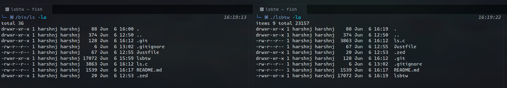

# lsbtw

Rewriting `ls` from scratch in plain C, because why not, they are doing a rust or zig rewrite these days.

It uses various syscalls to find the directory, list its contents, and get the information about each file (for the long list).

## Build

```bash
just build    # builds to a .gitignored `lsbtw` binary
# OR just run gcc -Wall -Wextra -o lsbtw ls.c
```

## Usage

```bash
./lsbtw

./lsbtw -a ~/Downloads

./lsbtw -la /etc
```

## Implementation

After parsing the options and path from cmdline args, it uses syscalls to get the directory contents and file information.

1. `opendir` / `closedir` -> returns the pointer to the directory stream. NULL if cannot open.
2. `readdir` -> reads the directory stream and emits dir entry `struct dirent`
3. `lstat` -> takes absolute path to the file and returns a `struct stat` with file information (permissions, user/group, size, dates etc).
4. `getpwuid/getgrgid` -> returns user and group information based on uid and gid

For finding total number of items and total size of the contents, we read the stream once before reading it again to
print the contents. This can be further optimized.

Padding and alignment is done using printf format strings.

```c
printf("%|10d|\n", 322);
```

will print

```bash
|       322|
```

adding a minus will make it left-aligned

```c
printf("|%-10|d\n", 322);
```

will print

```bash
|322       |
```

and a star will make it possible to pass a variable for the length.

```c
printf("%*d\n", 5, 322);
```

will print

```bash
|     322|
```

## Comparison

By no means this project plans to reimplement GNU ls utility, it is just a learning excuse and a way to have fun.


